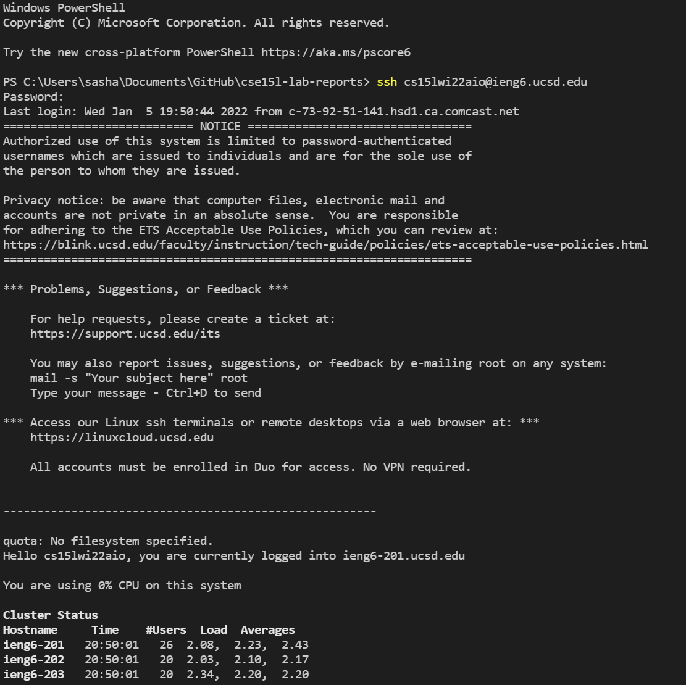

# Remote Access
One of the first things all CSE 15L students do is learn how to access the servers in the basement of the CSE building remotely. By doing so, it is possible to run larger programms efficiently than what a normal computer can handle. 

## Downloading VSCode

The first step to be able to remote access CSE computers is by installing VSCode on your computer. Downloading VSCode is as simple as going to their website, [Click here](https://code.visualstudio.com/), and clicking download for whatever system your computer uses. The website should look something like this:

## Remotely Connecting

After downloading VSCode, and setting it up, there are just a few more steps before you can send files to the remote computers. You need to find out what your UCSD login is for the remote computers for this class, whch can be found [here](https://sdacs.ucsd.edu/~icc/index.php). Also, if you are using a Windows computer, you need to download OpenSSH Client and OpenSSH programs on your computer. Once you have all this downloaded and you know your login, you can connect remotely using the ssh command in your terminal.

The command should return something similar to this. The terminal will ask for a password, so make sure you remember it!

## Trying Some Commands

After logging into the remote computers with the ssh command. 
