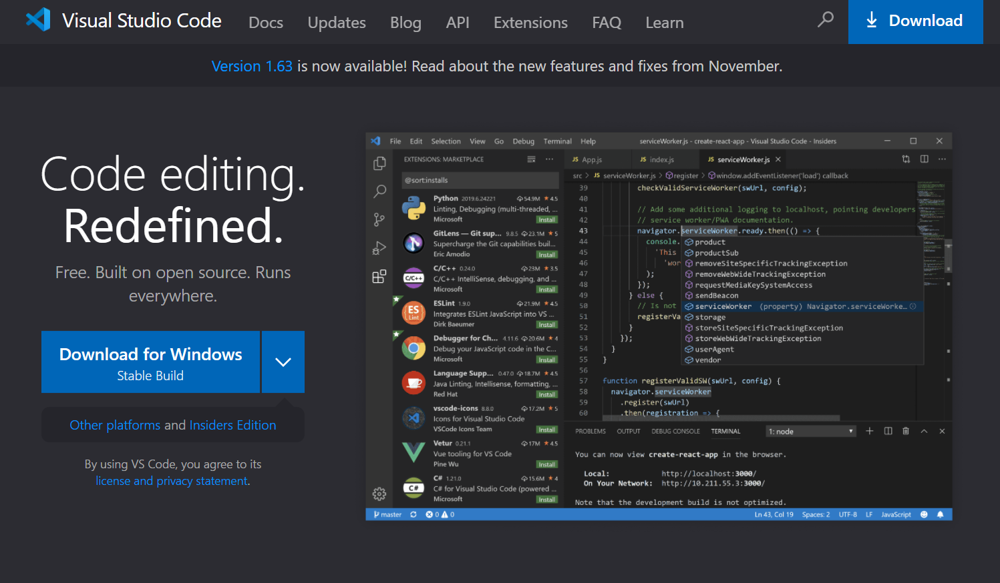

# Remote Access
One of the first things all CSE 15L students do is learn how to access the servers in the basement of the CSE building remotely. By doing so, it is possible to run larger programms efficiently than what a normal computer can handle. 

## Downloading VSCode

The first step to be able to remote access CSE computers is by installing VSCode on your computer. Downloading VSCode is as simple as going to their website, [Click here](https://code.visualstudio.com/), and clicking download for whatever system your computer uses. The website should look something like this:

## Remotely Connecting

After downloading VSCode, and setting it up, there are just a few more steps before you can send files to the remote computers. You need to find out what your UCSD login is for the remote computers for this class, whch can be found [here](https://sdacs.ucsd.edu/~icc/index.php). Also, if you are using a Windows computer, you need to download OpenSSH Client and OpenSSH programs on your computer. Once you have all this downloaded and you know your login, you can connect remotely using the ssh command in your terminal.

The command should return something similar to this. The terminal will ask for a password, so make sure you remember it!

## Trying Some Commands

After logging into the remote computers with the ssh command. There are many commands that you can put into the terminal. One of these commands is the "ls" (list directory), which displays the files that are saved on the remote server on your account. From the first lab, I transfered a file called "WhereAmI.java", so that is what is visible.

To see some details of where the file is stored, you can add a "-lat" or a "-a" to the "ls" command. The details of the directory of the first file I saved remotely can be seen in the image above.

## Moving Files

In order to run commands on files remotely, it is necessary to move files to the computers in the CSE building. This can be done with the scp command. While not logged into your account on the terminal, enter "scp", the file you want to copy, and your login. Enter your password, and the file is successfuly moved.

## SSH Key

Entering a password every time to do basically anything remote can be time consuming, so it is possible to make it so only your computer does not need a password with keygen. 

By typing "ssh-keygen", the computer generates a public and a private key, with the private key being on your computer. You can choose the directory to store it, and having a passphrase becomes optional or it can be simpler than the previous password since only your computer has this priviledge. 

## Optimizing Remote Running

There are many ways on how to make remote running the best it can be for yourself. The best thing I can recommend is for to experiment with different ways to minimize the number of steps it takes for you to run your program. Here are some things to try out to get you started. One thing which I like to do with commands is to use the up and down arrows in the terminal if I want to run a command that I already put in the terminal. Another thing which I like to do is have a .txt file with different commands that I put into the terminal in case I need to open a new terminal.

