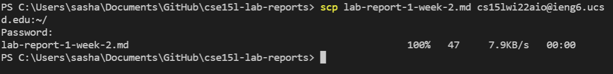

# Remote Access
One of the first things all CSE 15L students do is learn how to access the servers in the basement of the CSE building remotely. By doing so, it is possible to run larger programms efficiently than what a normal computer can handle. 

## Downloading VSCode

The first step to be able to remote access CSE computers is by installing VSCode on your computer. Downloading VSCode is as simple as going to their website, [Click here](https://code.visualstudio.com/), and clicking download for whatever system your computer uses. The website should look something like this:

## Remotely Connecting

After downloading VSCode, and setting it up, there are just a few more steps before you can send files to the remote computers. You need to find out what your UCSD login is for the remote computers for this class, whch can be found [here](https://sdacs.ucsd.edu/~icc/index.php). Also, if you are using a Windows computer, you need to download OpenSSH Client and OpenSSH programs on your computer. Once you have all this downloaded and you know your login, you can connect remotely using the ssh command in your terminal.

The command should return something similar to this. The terminal will ask for a password, so make sure you remember it!

## Trying Some Commands

After logging into the remote computers with the ssh command. There are many commands that you can put into the terminal. One of these commands is the "ls" (list directory), which displays the files that are saved on the remote server on your account. From the first lab, I transfered a file called "WhereAmI.java", so that is what is visible.

To see some details of where the file is stored, you can add a "-lat" or a "-a" to the "ls" command. The details of the directory of the first file I saved remotely can be seen in the image above.

## Moving Files

In order to run commands on files remotely, it is necessary to move files to the computers in the CSE building. This can be done with the scp command. While not logged into your account on the terminal, enter "scp", the file you want to copy, and your login. Enter your password, and the file is successfuly moved.

## SSH Key

Entering a password every time to do basically anything remote can be time consuming, so it is possible to make it so only your computer does not need a password with keygen. 

By typing "ssh-keygen", the computer generates a public and a private key, with the private key being on your computer. You can choose the directory to store it, and having a passphrase becomes optional or it can be simpler than the previous password since only your computer has this priviledge. 

## Optimizing Remote Running

There are many ways on how to make remote running the best it can be for yourself. The best thing I can recommend is for to experiment with different ways to minimize the number of steps it takes for you to run your program. Here are some things to try out to get you started. One thing which I like to do with commands is to use the up and down arrows in the terminal if I want to run a command that I already put in the terminal. Something like running a file can be done in just 2 keystrokes optimally, as you can see below.
* up arrow
* enter

When there are many different commands to run, the up and down arrows require an increasing number of keystrokes depending on how many different commands there are in the terminal, so it is nice to have a backup that has a more fixed number of keystrokes. The backup which I like to use is to have a .txt file with different commands that I put into the terminal in case I need to open a new terminal. This way they are stored in an easy to find place, but make sure that no vital information is stored in Github or somewhere public. Ideally, I will have the file open on the side of my screen so I do not need to click anywhere to find it. Putting any command that is in the .txt file is a fixed 6 keystrokes.
* Highlighting the desired command is first
* Copy with control+c are the second and third
* Clicking on the terminal is the fourth
* Pasting with control+v for the fifth and sixth keystrokes

Consider this hypothetical situation, you just opened up a new project that you want to run remotely. You have a certain idea of what commands you want to run, so you open up a .txt file and spend a few minutes typing them in. Sending the code to the remote server is then done with 6 keystrokes since the command is in the .txt file made earlier, and no password is required since the key was also generated earlier. The next step is to log into your account, which takes another 6 keystrokes, since the ssh command with the email is also in the .txt file. Knowing that it is possible to compile and run code with just one line using semicolons, you copy and paste that into the terminal, and find that the output is not the expected one. It took 18 keystrokes to get to this point, which might seem like a lot, but these commands stay in the terminal. You examine your code, find the bugs and change in a way you think it will work. Now it is time to send the code to the remote server again and run it. The commands that took 6 keystrokes to run can now be done in four, since all it takes is 3 up arrows and enter to run each command. This is a lot faster than the initial remote run since only 2 different keys are required to execute each command. The 3 commands together add up to 12 keystrokes, but since the keystrokes themselves are easier to execute, running the code remotely the second time was significantly quicker than the first one. 

This is a realistic scenario of running code remotely, and there will be many situations where doing the same thing for a second time can be done in a different way than the first time to optimize time. It is best to think about how many keystrokes it takes to enter commands as a general guideline, since just typing one command straight without any shortcut can take more keystrokes than running a whole file remotely with the shortcuts utilized in the scenario. Another very important thing to consider how comfortable the keystroke is for you. For me personally, I find that a mouse keystroke takes more time than a keystroke on the keyboard, so I only use the mouse for the initial commands in the terminal, and mainly use up and down arrows after. It is important to figure out what is best for you and what your preferences are to putting commands into the terminal.