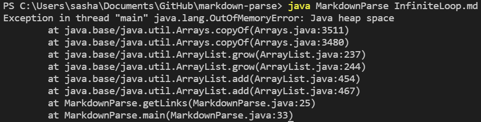

# Lab Report 2: Debugging MarkdownParse.java
## Case 1: Infinite Loop

One of the first things that was tried out on MarkdownParse.java was a Markdown file with multiple empty lines with even the first line being empty. With all of these new lines, we wanted to check if the condition of breaking the while loop is ever met. The file that we used to test this is [InfiniteLoop.md](https://alexander-kourjanski.github.io/cse15l-lab-reports/InfiniteLoop.md), which caused the symptom of an infinite loop in the terminal, making the file a failure-inducing input.

The way the bug was fixed was with adding a condition before adding a new link to toReturn, and that is if the current index, any bracket, or any parentheses is not found in the Markdown file, then the while loop will break.

## Case 2: Image vs. Link Distinction

The method, getLinks, only checked for brackets and parentheses to find a link in the Markdown file, however, images have a very similar syntax to links. It is the same bracket and parentheses, but there is an exclamation mark right before the open bracket. The fact that the program does not check for it could be a possible bug. The file [Image.md](https://alexander-kourjanski.github.io/cse15l-lab-reports/Image.md) was created to test for possible symptoms when it comes to distinguishing images and links. The program did not distinguish images and links since it thought that images were links, so the bug was confirmed. 

To the method getLinks, a condition to add a link to toReturn only if there was not an exclamation point preceding it was added.

## Case 3: Characters In Between Close Bracket and Open Parentheses

When looking through the code of MarkdownParse.java, it became apparent the code did not account for was what goes between each of these characters. The space between the parentheses is the link, and the space between the brackets is the text that the link will be hyperlinked into, but what about the space in between the close bracket and open parentheses? There should be no space in between them for the bracket and parentheses to qualify as a link since there could be markdown features that use only brackets, and other features that use only parentheses. Of course, being suspicious of code will not determine if the code has a bug or not without a proper test. The file [InBetween](https://alexander-kourjanski.github.io/cse15l-lab-reports/InBetween.md) to test if this possible bug does have a symptom with an undesired output with the program thinking line 2 contains a link, even though it should not. Since the file did produce the undesired output we were expecting, the file [InBetween](https://alexander-kourjanski.github.io/cse15l-lab-reports/InBetween.md) is a failure-inducing input.

The condition that the open parentheses has to have an index one greater than the index of the close bracket was implemented, and that solved the issue.

