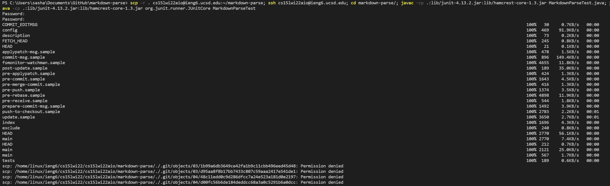

# Lab Report 3: Copying an Entire Directory With the Command scp -r

One nice thing that the command line can do is copy an entire directory into a remote server account with just 1 command, and that is with the command scp -r. By doing so, all the files are copied in the same folders as they are on the main computer. Let us run through this process with the directory [markdown-parse](https://github.com/Alexander-Kourjanski/markdown-parse).

From just 1 line in the terminal, all of these files can be copied. We can then run these files in the remote servers as seen below.

It is necessary after logging in into the remote server, to access the directory with cd. Afterwords, it is possible to run the tests in markdown-parse.

By using the semicolon in the terminal, it is possible to run multiple commands in one line. However, the minimum number of lines required to run the tests remotely is 2. 

As you can see here, the scp and ssh commands run after the first line, but the last 3 do not. This is because the last 3 are commands that run on the remote server while the first 2 are done on this computer, so they have to be done separately. A way to optimize it can be seen in the last image where the 3 commands are separated by semicolons.