# Lab Report 4: Testing Snippets

Before we get started looking at each snippet, here are the links to [My Markdown Parse](https://github.com/Alexander-Kourjanski/markdown-parse) and to the [MarkdownParse I reviewed](https://github.com/austin-li/CSE15L-TheLunaMoths).

## Snippet 1

Using the CommonMark demo site, the output should be something like this.

Only the second, third, and fourth lines count as links, and the first one does not. This means that the links are `google.com, google.com, and ucsd.edu.

### My MarkdownParse

For my MarkdownParse, I ran the following junit test.

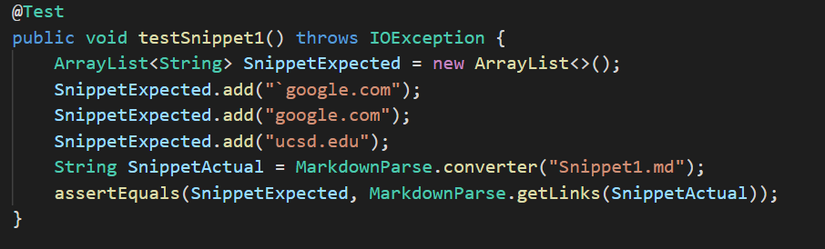

When running the test, I got the following results.

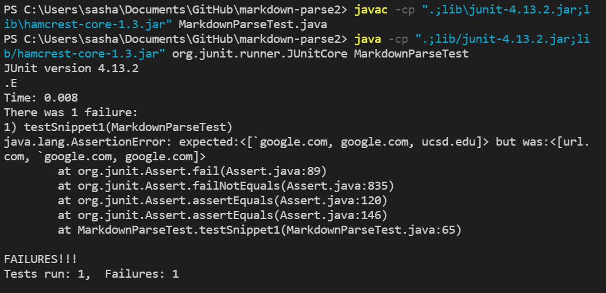

My getLinks method does not work correctly for Snippet1, making Snippet1 a failure-inducing input for my program. 

### Reviewed MarkdownParse

For the MarkdownParse I reviewed, I ran the following junit test.

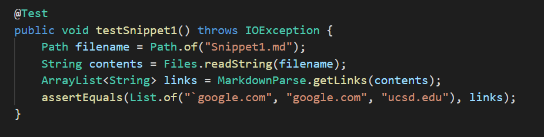

When running the test, I got the following results.

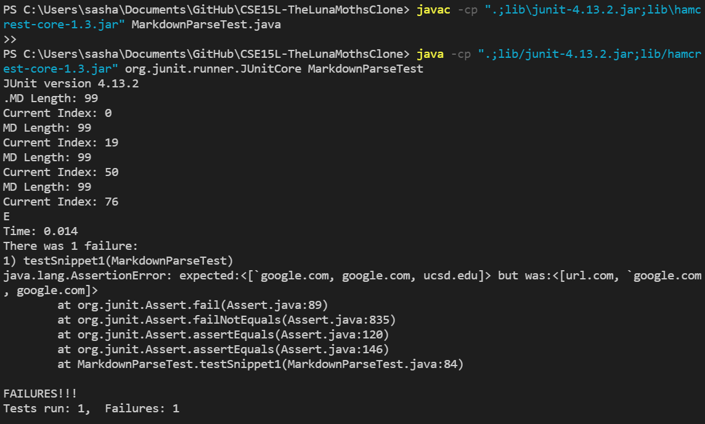

This means that the getLinks method is not working as expected for this Markdown file, making Snippet1 a failure-inducing input for the implementation I reviewed as well.

### Possible Fixes

A possible way to fix the code is that when the string is searching for the open and close bracket, if there is a \" \` \" in the code, ignore all brackets until the next \" \` \" . The way to implement this is to find all the indexes of \" \` \" in the string, and when finding the index of open and close brackets, skip the indexes in between the first and second, third and fourth, etc. With the exception when there is a \" \ \" before the \" \` \". This does not have to be done to parentheses because of how the code parts did not matter with the parentheses. I think this is a possible adjustment to make in under 10 lines of code, but would definiately be near the maximum of what is considered a small change.

## Snippet 2

Using the CommonMark demo site, the output should be something like this.

The nested link, nested parentheses, and brackets with a \" \ \" infront of it all do not count as links with Markdown. That means the links are b.com, a.com(()), and example.com.

### My MarkdownParse

For my MarkdownParse, I ran the following junit test.

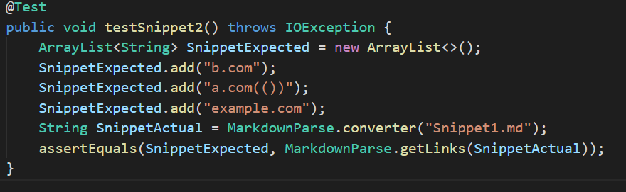

When running the test, I got the following results.

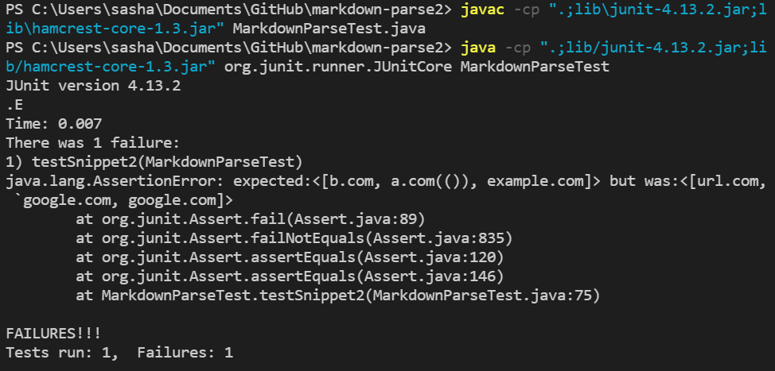

My getLinks method does not work correctly for Snippet2, making Snippet1 a failure-inducing input for my program. 

### Reviewed MarkdownParse

For the MarkdownParse I reviewed, I ran the following junit test.

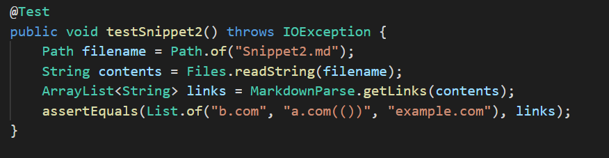

When running the test, I got the following results.

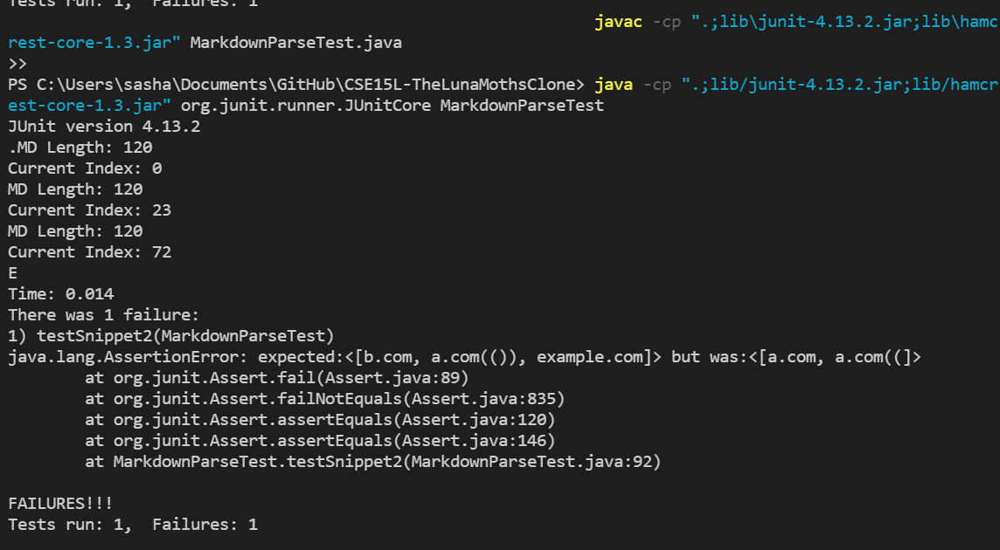

This means that the getLinks method is not working as expected for this Markdown file, making Snippet2 a failure-inducing input for the implementation I reviewed as well.

### Possible Fixes

Fixing the code so that it works with Snippet 2 is near impossible to do in under 10 lines, but I do not think that it would take much more than that. For the first 2 links, there is a nested set of brackets and parentheses that do not change where the program thinks the link is. The best way to handle this is to make a method that takes in a certain character pair of characters, and when the first one is called, a counter for number of times the second has to be found goes up by 1. The counter starts at 1. When the second character argument is found in the string, then the counter goes down by 1. Then the method returns either the index when the counter is 0, or the index of the last second character argument found. 

When dealing with the third line, just make a condition that the brackets cannot have \" \ \" right before it, and keep on searching for the next instance of the bracket.

## Snippet 3

Using the CommonMark demo site, the output should be something like this.

The links with a line break in either the brackets or parentheses do not count as a link. The only link in this file is https://ucsd-cse15l-w22.github.io/. 

### My MarkdownParse

For my MarkdownParse, I ran the following junit test.

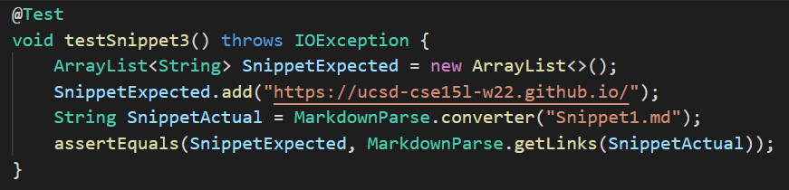

When running the test, I got the following results.

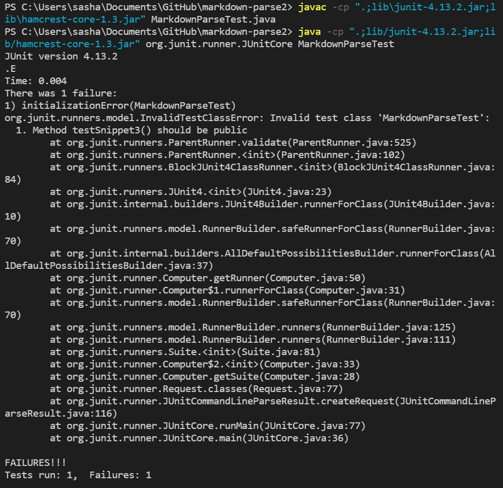

My getLinks method does not work correctly for Snippet1, making Snippet3 a failure-inducing input for my program. 

### Reviewed MarkdownParse

For the MarkdownParse I reviewed, I ran the following junit test.

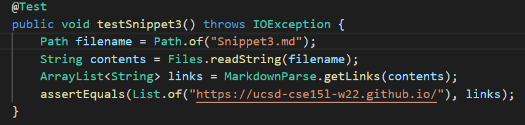

When running the test, I got the following results.

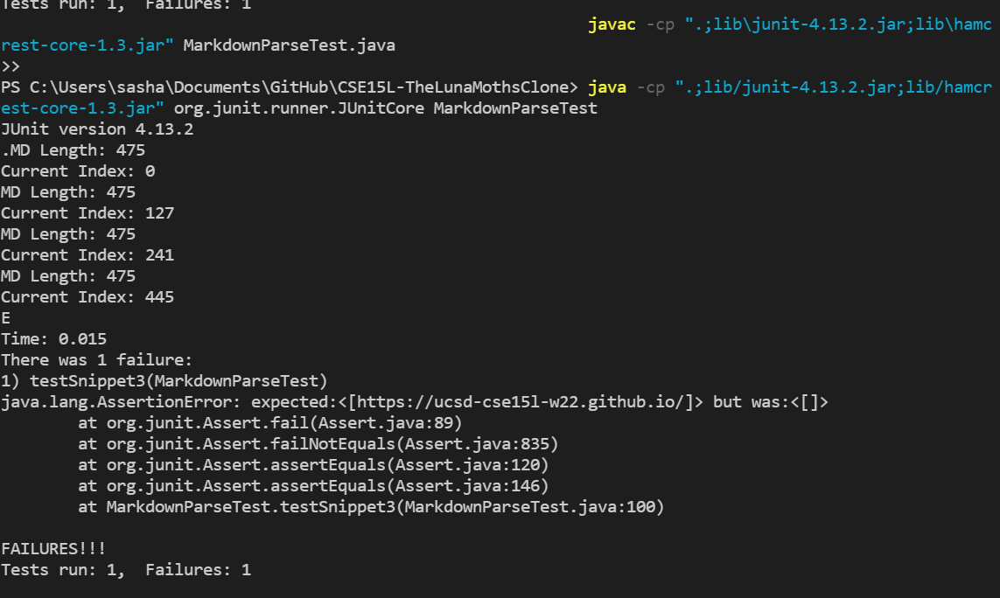

This means that the getLinks method is not working as expected for this Markdown file, making Snippet3 a failure-inducing input for the implementation I reviewed as well.

### Possible Fixes

The way to handle Snippet3 is to have it so that when searching for a close bracket or a close parentheses, once a second \" \n \" is found, continue the loop with the currentIndex right after nextOpenBracket. That way the finding link process resets and can find new links starting after the last possible link was. The reason why this is not after the new line character is because there could be an actual link nested within what we just determined is not a link.