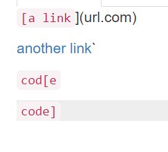
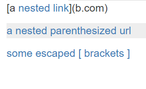
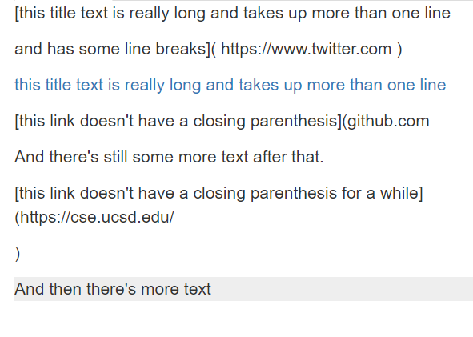

# Lab Report 4: Testing Snippets

Before we get started looking at each snippet, here are the links to [My Markdown Parse](https://github.com/Alexander-Kourjanski/markdown-parse) and to the [MarkdownParse I reviewed](https://github.com/austin-li/CSE15L-TheLunaMoths).

## Snippet 1

Using the CommonMark demo site, the output should be something like this.

Only the second, third, and fourth lines count as links, and the first one does not. This means that the links are `google.com, google.com, and ucsd.edu.

## Snippet 2

Using the CommonMark demo site, the output should be something like this.

The nested link, nested parentheses, and brackets with a \ infront of it all do not count as links with Markdown. That means the links are b.com, a.com(()), and example.com.

## Snippet 3

Using the CommonMark demo site, the output should be something like this.

The links with a line break in either the brackets or parentheses do not count as a link. The only link in this file is https://ucsd-cse15l-w22.github.io/. 