# Lab Report 5: Comparing Different Implementations

The way that I found a difference in output of the two different implementations was by using diff, which compares the output of each test file that was put in results.txt. This command compares the output of each implementation with each other, and prints out all the instances where the results are different from each other.

When reading the output of this command, there is a number that is associated with two different outputs, one for each implementation. An example of this is

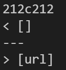

The number is the line in the file where this difference occurs. By using the command `cat -n`, we can find the line in the results file, and the line above it is the test case that gave the different results for the two implementations. A part of the command looks like

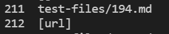

In this example, the test file we would look at is test file 194, and this will be the first example we are going to look at.

## Difference 1: File 194.md

The first file that we are going to be talking about where the implementations gave two different results is with 194.md. The file itself looks like this

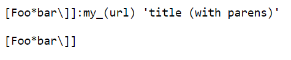

This is the expected output of this file

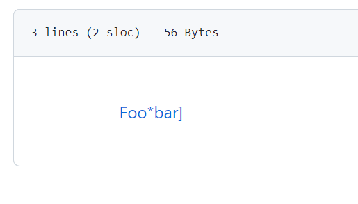

As you can see, there is one link that is in the file, and the link itself that is used is "my_(url)". 

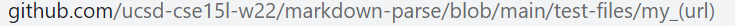

Let us look at the week 9 implementation of Markdown Parse.

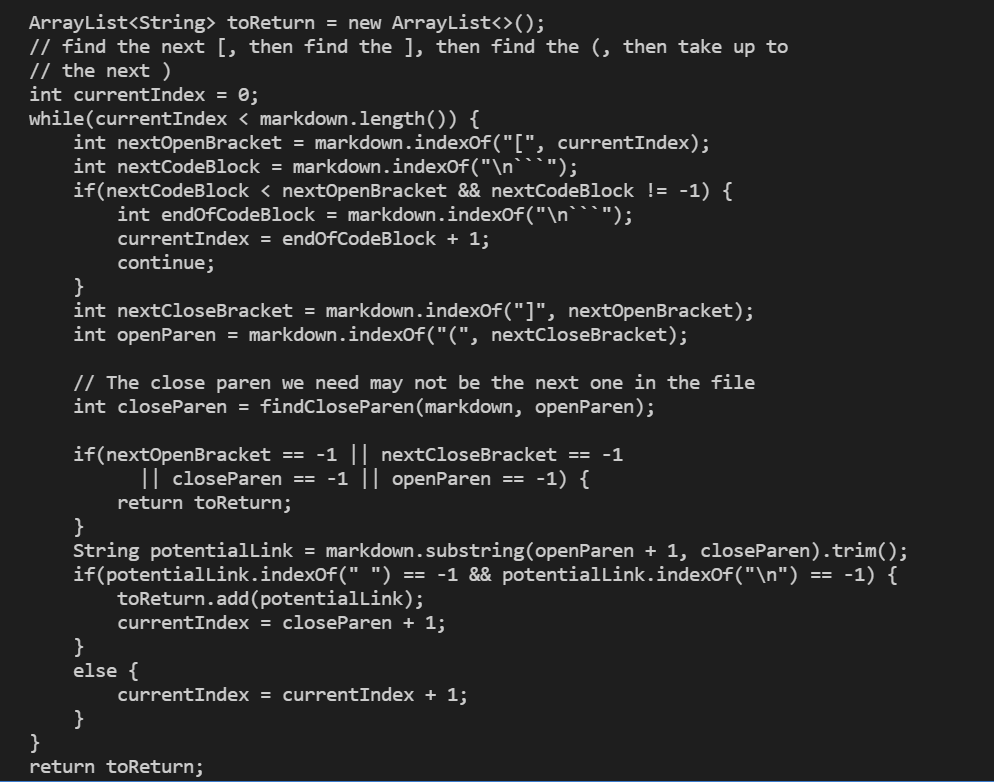

In this implementation, there is no code dealing with a colon right after the brackets. The way to fix this will be to add a case for when there is a colon right after the nextCloseBracket. It will take the next set of characters until a space is found as the link. This does not have anything to do with parenthesis actually, and I did not even realize this was a proper link syntax of markdown that was available. Neither implementation had a case that had a colon right after nextCloseBracket in getLinks as seen above, so the problem is that neither program even thought of addressing this.

## Difference 2: File 201.md

Another difference was found on line 270 of the results file.

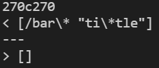

When using cat, we found out that this has to do with the 22nd test file.

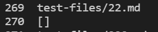

The markdown code looks like this,

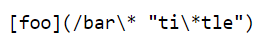

and the markdown output looks like this.

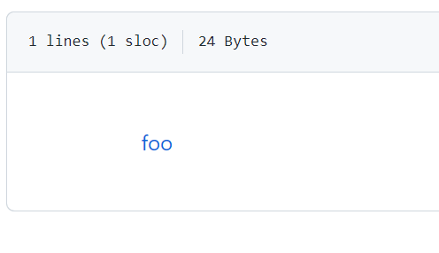

When clicking on the link "foo", we get

The Markdown code should take one link and that link should be "bar*" according to the link we clicked from the expected output. From the image above, this means that neither implementation is correct. Let us look at my implementation of MarkdownParse.

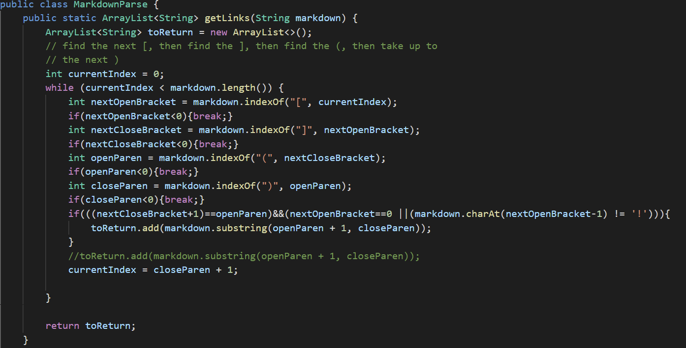

The getLinks method does not have any place in the code that leaves out quotes, slashes, and backslashes. There should be code added that does this, then trim the string. Only after all this is done should the link be added to toReturn.