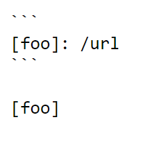

# Lab Report 5: Comparing Different Implementations

The way that I found a difference in output of the two different implementations was by using diff, which compares the output of each test file that was put in results.txt. This command compares the output of each implementation with each other, and prints out all the instances where the results are different from each other.

## Difference 1: File 212.md

The first file that we are going to be talking about where the implementations gave two different results is with 212.md. The file itself looks like this

Since there are no links that follow the proper bracket and parenthesis format, that means there should be no links taken, however, we end up with this from diff.