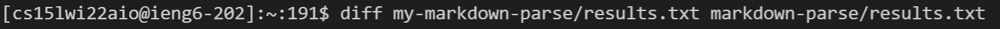

# Lab Report 5: Comparing Different Implementations

The way that I found a difference in output of the two different implementations was by using diff, which compares the output of each test file that was put in results.txt. This command compares the output of each implementation with each other, and prints out all the instances where the results are different from each other.

When reading the output of this command, there is a number that is associated with two different outputs, one for each implementation. An example of this is

The number is the line in the file where this difference occurs. By using the command `cat -n`, we can find the line in the results file, and the line above it is the test case that gave the different results for the two implementations. A part of the command looks like

In this example, the test file we would look at is test file 194, and this will be the first example we are going to look at.

## Difference 1: File 194.md

The first file that we are going to be talking about where the implementations gave two different results is with 194.md. The file itself looks like this

Since there are no links that follow the proper bracket and parenthesis format, that means there should be no links taken, however, we end up with this from diff.

The output of my Markdown Parse is an empty list, but the other implementation contains url in the output. There is no link within parenthesis in the code, so the expected output should be an empty list, so the implementation given for week 9 is incorrect.

## Difference 2: File